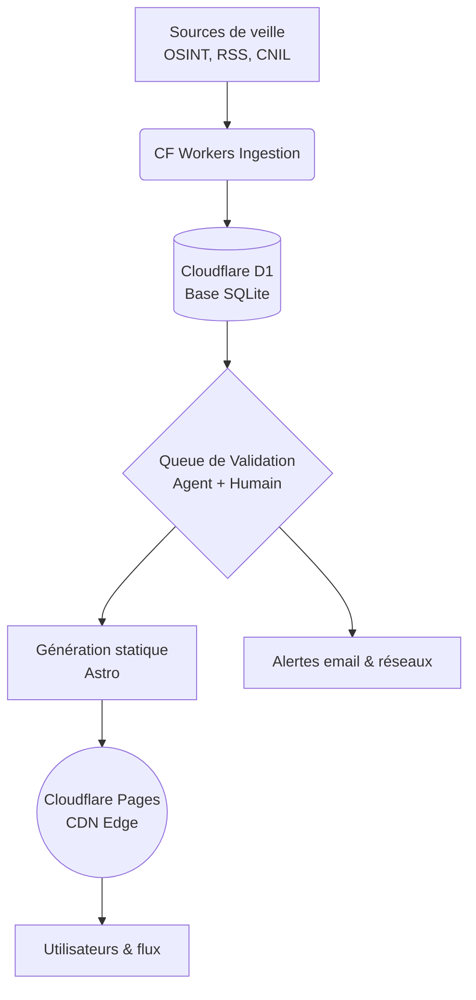

<div align="center">
  <a href="https://francepassoire.com">
    
  </a>

  <h1>FRANCEPASSOIRE</h1>

  <p><strong>La France, passoire à données. On compte les trous.</strong></p>

  <p>
    <a href="https://github.com/aloyopenclaw/francepassoire.com/blob/main/LICENSE"></a>
    <a href="https://creativecommons.org/licenses/by/4.0/"></a>
    <a href="https://francepassoire.com"></a>
    <a href="https://francepassoire.com/dataset/catalogue.json"></a>
    <a href="https://pages.cloudflare.com/"></a>
    
  </p>
</div>

> The French civic data-breach observatory : tracking the holes in the national sieve through open data and a tamper-evident integrity chain.

**France Passoire** documente, consolide et archive publiquement les fuites de données touchant les citoyens et organisations françaises. Notre rôle n'est pas de pointer du doigt, mais de rendre à l'information publique sa lisibilité. Nous distinguons rigoureusement une fuite *Revendiquée* (un attaquant l'affirme, le trou est potentiellement encore ouvert) d'une fuite *Confirmée* (l'entité ou une source officielle a validé l'incident, le trou est colmaté).

[→ Découvrir notre méthode complète et nos sources](https://francepassoire.com/methode/)

---

## 💧 Le projet en 30 secondes

*   **1 800+ pages générées** statiquement à partir d'un catalogue public exhaustif, construit à partir de sources publiquement disponibles.
*   **883+ fiches de fuites** documentées (au 22 août 2026), avec séparation stricte des statuts.
*   **Surveillance automatisée et humaine** : croisement de sources OSINT, presse spécialisée, notifications CNIL et signalements citoyens.
*   **Alerte temps réel** : système gratuit de notification (« Veille ») par secteur et type de données, construit sur le principe du *privacy by design*.

---

## La chaîne d'intégrité

L'information sur les fuites de données subit des pressions constantes : menaces judiciaires infondées, tentatives de minimisation, ou demandes de suppression discrète. Un observatoire civique ne peut pas se contenter d'une base de données modifiable en silence.

C'est pourquoi toute notre donnée est ancrée dans une **chaîne d'intégrité à preuve de falsification** (*tamper-evident*).
Chaque ajout, modification ou retrait légal génère un événement haché (SHA-256) qui inclut l'empreinte de l'événement précédent. Il est mathématiquement impossible d'altérer l'historique de la plateforme sans invalider toute la chaîne.


### Comment vérifier l'intégrité vous-même ?

Vous n'avez pas à nous croire sur parole. La chaîne est vérifiable de trois manières :

1. **Le registre brut** : téléchargez la chaîne complète sur [francepassoire.com/registre.jsonl](https://francepassoire.com/registre.jsonl).
2. **Vérification locale (hors ligne)** : clonez ce dépôt et exécutez notre script sans aucune dépendance :

```bash
node scripts/verify-registry.mjs ./registre.jsonl
```

3. **Ancrages décentralisés (Nostr)** : les empreintes périodiques sont publiées sur des relais Nostr publics hors de notre contrôle. [Voir la méthode et la liste des relais](https://francepassoire.com/methode/).

Chaque ligne du fichier `registre.jsonl` contient :

* `seq` : numéro de séquence (index strict).
* `date` : date de l'événement.
* `type` : le type d'événement (`ajout`, `correction`, `retrait`).
* `entite` : le nom de l'entité concernée.
* `fiche_du` : la date de la fiche visée.
* `empreinte_precedente` : l'empreinte SHA-256 de la ligne précédente (`null` au bloc genèse).
* `empreinte` : l'empreinte SHA-256 du contenu de cet événement.

<details>
<summary>Exemple de ligne du registre</summary>

```json
{"seq": 402, "date": "2026-08-22", "type": "correction", "entite": "Groupe Lenormant", "fiche_du": "2026-08-19", "empreinte_precedente": "a1b2…", "empreinte": "c3d4…"}
```
</details>

---

## Données ouvertes & flux

Le catalogue entier est publié sous licence ouverte **CC-BY-4.0**. Il n'y a pas de clé API, pas d'authentification, et pas de limitation artificielle de requêtes.

| Route | Description | Format |
| --- | --- | --- |
| `GET /dataset/catalogue.json` | L'export complet et stable du catalogue (schéma v1). | JSON |
| `GET /feed.xml` | Le flux RSS global des dernières revendications et confirmations. | RSS 2.0 |
| `GET /feed/<secteur>.xml` | Flux RSS filtrés par secteur (ex. `/feed/sante.xml`). | RSS 2.0 |
| `GET /embed/compteur` | Le Compteur National intégrable via iframe. | HTML |

**Attribution requise :** si vous utilisez nos données, vous devez inclure un crédit clair et un lien.
*Exemple de mention :* `Données issues du catalogue ouvert de francepassoire.com (CC-BY-4.0)`.

---

## Architecture

France Passoire est conçu pour la haute disponibilité et la résilience, même en cas de fort trafic lors d'une alerte nationale.



* **Front-end & SSG** : Astro 7, TypeScript, TailwindCSS (strictement cadré).
* **Infrastructure (edge)** : Cloudflare Pages, Cloudflare Workers, Cloudflare D1 (SQLite distribué) pour le staging, Cloudflare KV.
* **Veille & emails** : CF Workers Cron Triggers + CF Email Routing.
* **CI/CD** : GitHub Actions pour les tests d'intégrité, la validation des PRs de données, et le déploiement.

---

## Contribuer

L'observatoire s'améliore grâce à la vigilance collective.

* **Signaler une fuite :** vous avez reçu un mail de notification d'une entreprise ou identifié une revendication ? [Utilisez le formulaire sécurisé](https://francepassoire.com/signaler/).
* **Corriger une erreur :** pour toute mise à jour de statut (avec preuve) ou correction typographique, ouvrez une *Issue* sur ce dépôt.
* **Ce que nous refusons fermement :** ne publiez **jamais** d'extraits de bases de données volées ou d'informations personnelles (PII) sur ce dépôt. Nous ne collectons et ne traitons que des métadonnées (qui revendique quoi, quand, et quel est le statut).

🔔 *Pour les demandes légales ou de retrait de la part d'entités concernées, veuillez lire notre stricte [politique de retrait](https://francepassoire.com/methode/) avant toute démarche.*

---

## Licence (double)

Le projet France Passoire opère sous une double licence :

* **Le code source** (ce dépôt) est sous licence **AGPL-3.0**. Toute modification du code déployée sur un serveur (SaaS/Web) doit voir son code source modifié publié sous la même licence. Cela garantit que les outils de transparence restent transparents.
* **Les données et le contenu** (le catalogue JSON, les fiches) sont sous licence **CC-BY-4.0**. Vous êtes libre de les copier, diffuser et utiliser, même commercialement, à l'unique condition d'en créditer l'origine.

---

<!-- Méta-données GitHub (à configurer dans les paramètres du dépôt) — retirer ce bloc avant publication si souhaité -->

### Méta-données GitHub

| Paramètre | Valeur suggérée |
| --- | --- |
| **Homepage** | `https://francepassoire.com` |
| **Description** (Option 1 — Courte) | L'observatoire civique des fuites de données en France. On compte les trous de la passoire nationale. Données ouvertes CC-BY. |
| **Description** (Option 2 — Complète) | La France, passoire à données : l'observatoire citoyen qui recense, vérifie et archive les fuites de données françaises. Registre à preuve de falsification et données ouvertes CC-BY. |
| **Description** (Option 3 — Action) | Tracking exhaustif des fuites de données françaises. Catalogue public, chaîne d'intégrité décentralisée et données ouvertes CC-BY. Pas de panique. Mais agissons. |
| **Topics** (Tags) | `fuite-de-donnees`, `cybersecurity`, `rgpd`, `vie-privee`, `osint`, `france`, `civic-tech`, `observatoire`, `astro`, `cloudflare-workers`, `typescript`, `d1` |

#### Spécification pour l'image Social Preview (opengraph)

L'image à uploader sur GitHub (1280×640 px) doit être générée par le pipeline og-image avec ces contraintes :

* **Fond** : orange `#FF6B1A` avec le motif *dot-matrix* (points encre `#241405`) couvrant toute la surface.
* **Titre central** : le logotype FRANCEPASSOIRE en *Bricolage Grotesque*, très massif, couleur encre.
* **Sous-titre** : « La France, passoire à données. On compte les trous. »
* **Éléments visuels** : deux pastilles de statut flottantes — une orange « Revendiquée » avec le motif à trous, une verte pleine « Confirmée » — pour illustrer immédiatement la mécanique du site.
* **Badge coin inférieur droit** : mention « Données ouvertes CC-BY » en police monospace, fond crème `#FFF6EA`.
